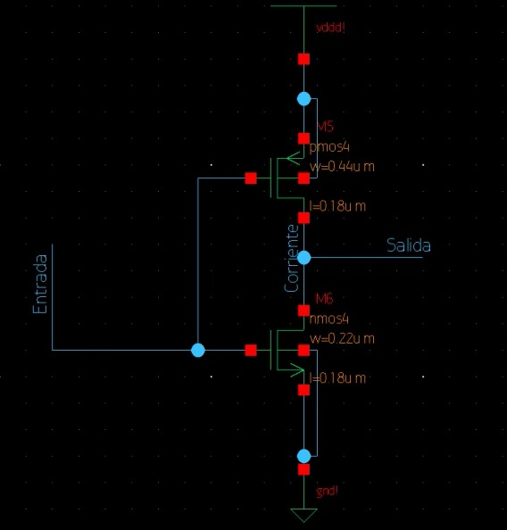

# Tarea_1_VLSI_II_2024
Integrantes del grupo:

* Francisco Coto Alcázar
* Andrés Rojas Barboza
* Bernal Jesús Zamora Barrantes

## Parte 1 Determinación de las resistencias de canal de transistores mí­nimos NMOS y PMOS para el proceso XH018. Módulo LPMOS: ne, pe (1,8V).

### a) Determinación de la resistencia efectiva

**nMOS**
$$I_{Ln} = 3  pA/ \mu m$$

$$I_{Hn} = 475 \mu A/ \mu m$$

$$I_{effp} = (3 pA/ \mu m + 475 \mu A/ \mu m)/2 = 237.5 \mu A* \mu m$$

$$R = 1.8/(2*237.5 \mu A/ \mu m) = 3.789 k \ohm * \mu m = 22.288 k \ohm$$

$$R_{step n} = 1.8/(2*475 \mu A/ \mu m) = 1.894 k \ohm * \mu m = 11.141 k \ohm$$

**pMOS**
$$I_{Lp} = 3  pA/ \mu m$$

$$I_{Hp} = 170  \mu A/ \mu m$$

$$I_{effp} = (3 pA/ \mu m + 170 \mu A/ \mu m)/2 = 85 \mu A/ \mu m$$

$$R = 1.8/(2 * 85 \mu A\mu m) = 10.588 k \ohm * \mu m = 42.352 k \ohm$$

$$R_{step p} = 1.8/(2 * 170 \mu A) = 5.294 k \ohm * \mu m = 21.176 k \ohm$$

La ecuación: $R = V_{DD}/2*I_{eff}$ lo cuál es la misma a la ecuación $R = V_{DD}/I_{H}+I_{L}$, donde la $I_{eff}$ corresponde a la corriente efectiva que fluye por la resistencia $I_{H}$ y $I_{L}$ son las corrientes en alto y en bajo respectivamente, en el circuito. Esta ecuació³n también toma en cuenta otras corrientes del circuito

Por su parte la ecuación: $R = (3* ln(2))/4 * (Vdd/I_{sat})$ toma en cuenta la corriente de saturación del transistor y la tensión de alimentación, esta se relaciona más al modelo de pequeña señal del transistor y también contempla la corriente de saturación y la resistencia efectiva.

### b) Cálculo de capacitancia de compuerta

**nMOS**

$$ C_{gn} = 0.66 * 0.17 * 0.16 * 8.46 fF + 0.17 * 0.33 fF = 0.209 fF$$

$$ \tau = 3RC = 3*22.288 k \ohm * 0.209 fF = 13.97 ps$$

**pMOS**

$$ C_{gn} = 0.66 * 0.25 * 0.15 * 8.91 fF + 0.25 * 0.32 fF = 0.302 fF$$

$$\tau = 3RC = 3*42.352 k \ohm * 0.302 fF = 38.37 ps$$
  

## Parte 2 Diseño de un inversor mínimo de tamaño óptimo

### a. Diagrama del inversor a nivel de transistores

A continuación se muestra el esquemático de un inversor a nivel de transistores. Este diagrama ilustra la configuración básica del inversor y los tamaños de los transistores.

### Caracterizacion de los transistores

A continuación se muestran las gráficas de las curvas caracterí­sticas tanto del nMOS como del pMOS, como se puede observar ambos transistores se encuentran en saturación. La primer gráfica corresponde al nMOS y la segunda corresponde al pMOS. Para verificar la saturación unicamente se puede observar como a partir te la tensión $V_{gs}=1.8V$ estás corresponde a cada una de las líneas que salen del origen y en algunos momentos presentan un comportamiento cuadratico por su parte el eje x corresponde a $V_{DS}$ y el eje y $I_{DS}$. Al observar la línea de $V_{gs} = 1.8V$ se puede observar como presenta un comportamiento lineal

### Corriente de cortocircuito

A partir de la siguiente Figura se puede observar como la corriente de cortocircuito tiene un valor de $I_{corto} ≈ 30pA$

### Esquinas

Para esta parte lo que se hace es cambiar las librerí­as para así modificar la velocidad de los transistores.

La siguiente Figura corresponde a FF

La siguiente Figura corresponde a FS

La siguiente Figura corresponde a SF

La siguiente Figura corresponde a SS

### b.i tpd vs. la relación PMOS/NMOS

A continuación se muestra como evoluciona el tiempo de respuesta en relacion con la proporcion de tamaño, claramente se puede observar que en 2.4 tiene un minimo por lo que se puede concluir que la mejor relacion es aproximadamente 2.4 P/N 

### fo4 optimizado

### c. Valores de Rp y Rn

Al obtener que la mejor relación corresponde a 2.5, entonces se realiza la ejecución con esta relación y se obtienen los siguientes tiempos 

A partir de estos se utiliza las ecuación 8.8 del libro debido a que del FO4 son los segmentos donde se han realizado las pruebas. La ecuación es:

$$â–³t_{pdr} = 3/2 (2*R_{p})*C$$

$$â–³t_{pdf} = 3 (2*R_{n})*C$$

A partir de estos ya se tienen todas las constantes menos el valor de $R_n$ y $R_p$ entonces se realiza las sustituciones y los resultados obtenidos son:

$$R_{p} = 27.3k \ohm ≈ 27k\ohm \mu m\$$

$$R_{n} = 13.86k \ohm ≈ 13k\ohm \mu m$$

De lo anterior se puede observar como la relación que usualmente se maneja de $R_{p} = 2*R_{n} \ohm$ se puede decir que se cumple. En cuánto a la preferencia se prefiere el resultado obtenido en el punto c debido a que este método elimina los efectos debidos a las parasitancias y toma en cuenta el efecto de la pendiente realística de las señales de entrada, además de que al colocar una carga que corresponde al 4 inversor permite un análisis mejorado que en la primer parte que nada más se toma en cuenta valores brindados por el fabricante.

## Referencias
[1] N. Weste and D. Harris, CMOS VLSI Design: A Circuits and Systems Perspective, 4 edition. Boston: Addison-Wesley, 2010.

[2] Process and Device Specification XH018 - 0.18 μm Modular Mixed Signal HV CMOS, PDS-018-13. Release 7.0.1. XFAB Semiconductor Foundries, Nov. 2017.

[3] J. Rabaey, A. Chandrakasan y B. Nikolic. Digital Integrated Circuits: A Design Perspective.
